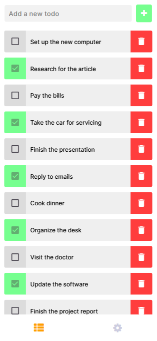
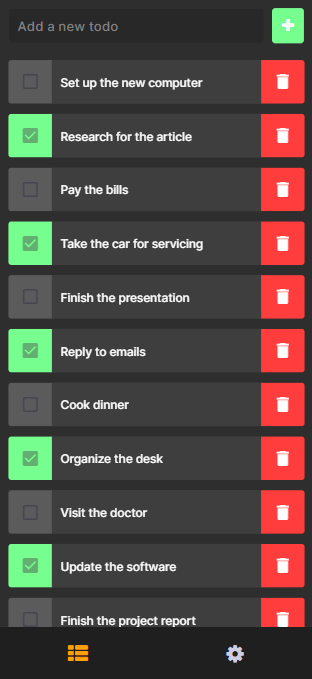

# 📝 Todo App  

A simple Todo App developed with **React Native** and **Expo**. This app allows users to manage their daily tasks efficiently with a clean UI and essential task management features.  

## 📱 Key Features  
- ✅ **Create, Edit, Delete todos**  
- ✅ **Mark todos as completed**  
- ✅ **Change app theme (Dark/Light Mode) via Settings**  
- ✅ **Tab Navigation for easy access to different screens**  

## 🛠️ Tech Stack  
This app was developed with:
- **React Native** – Framework for building mobile apps  
- **Expo** – Simplifies development and testing  
- **React Navigation** – Handles screen navigation  
- **AsyncStorage** – Local storage for saving tasks  

## Screenshots
Below are the app’s theme variations, highlighting both Light and Dark modes.

  
  &nbsp;&nbsp;&nbsp;
  

## How It Works

The app stores todos locally on the device using **AsyncStorage**. Users can toggle between Light and Dark themes in the Settings screen, which updates the app's theme accordingly. The app also allows editing and removing todos.
